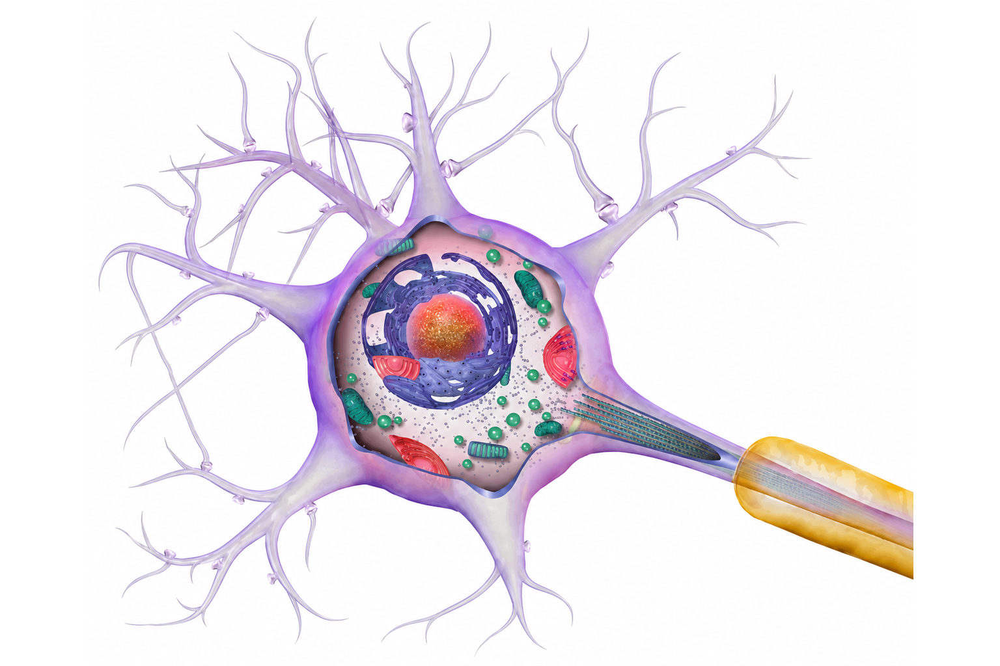
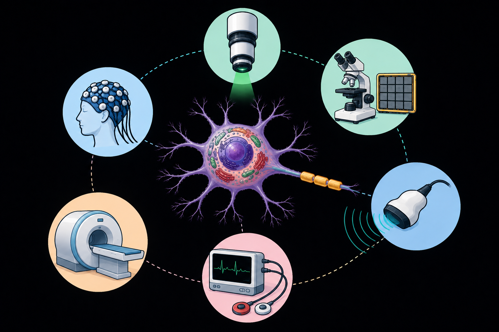
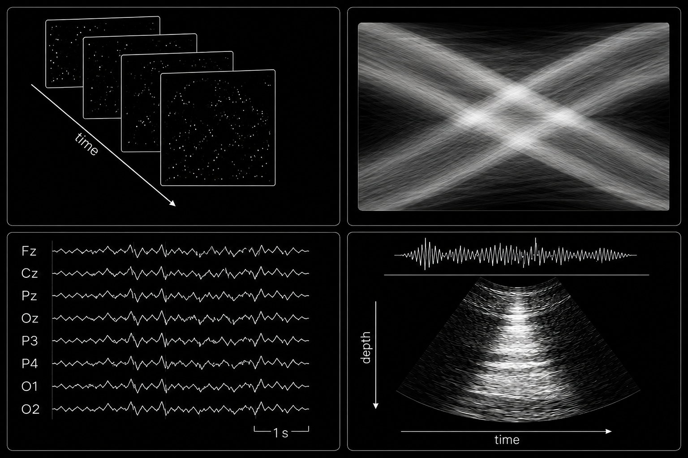
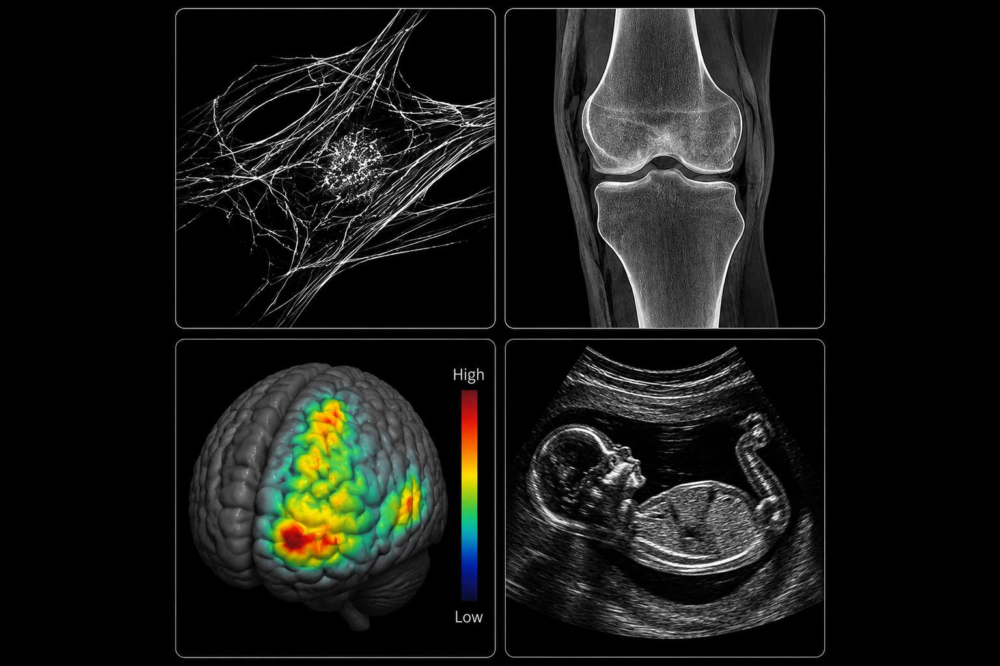
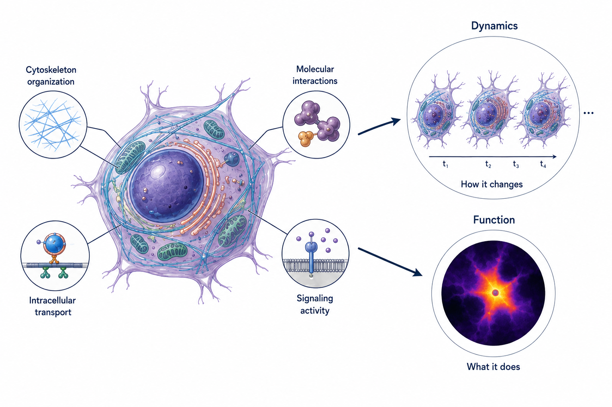

<!-- =======================================================
     FROM BIOLOGICAL QUESTION TO INFERENCE
     ======================================================= -->

<section class="biological-chain-section">

FROM BIOLOGICAL QUESTION TO INFERENCE

<h2>
From a biological question 
to an interpretable quantity.
</h2>

The quantity of interest for biologist is often not directly observable. Instead,
a physical instrument detects a signal that is only indirectly related to it. The task is
therefore to understand this relationship and recover the information that the
measurement encodes.

<!-- =======================================================
     BIOLOGY — MATHEMATICS — PHYSICS
     ======================================================= -->

Biology defines what matters.

Physics determines what is measured.

Mathematics connects the two.

<!-- =======================================================
     SIX-STEP CHAIN
     ======================================================= -->

<!-- BIOLOGICAL SYSTEM -->

BIOLOGICAL SYSTEM

Biological question

Structure · dynamics · function

→

<!-- MEASUREMENT -->

MEASUREMENT

Physical acquisition

Detector · hardware · acquisition

→

<!-- RAW DATA -->

RAW DATA

Detected signal

Space · time · channels

→

<!-- MATHEMATICS -->

MATHEMATICS

y = Ax

p(x | y)

xk+1 = T(xk)

xk − x* ≤

C
k

From measurement to inference

Physical · statistical · numerical structure

→

<!-- INFERRED QUANTITIES -->

INFERRED QUANTITIES

Latent quantities

Parameters · estimates · uncertainty

→

<!-- INTERPRETATION -->

INTERPRETATION

Biological insight

Quantitative biological or biomedical meaning

<!-- =======================================================
     FEEDBACK LOOP
     ======================================================= -->

FEEDBACK / MEASUREMENT DESIGN

Inference can shape how and what is measured next.

</section>

<!-- =======================================================
     INSIDE THE MATHEMATICAL BLOCK
     ======================================================= -->

<section class="mathematical-block-section">

INSIDE THE MATHEMATICAL BLOCK

<h2>
From raw measurements 
to a reliable inference.
</h2>

I model how the physical and statistical measurement process generates the data,
formulate the resulting inverse or estimation problem, and design computational
methods adapted to its mathematical structure. Their assumptions, stability and
behaviour are then analysed to assess how reliably the inferred quantities can be
recovered.

<!-- =======================================================
     MODEL — FORMALIZE — SOLVE — ANALYSE
     ======================================================= -->

01

Model

Describe how the physical system and the acquisition process generate
the observed data.

Physics · statistics · forward model

→

02

Formalize

Identify the unknown quantities, the available information and the
assumptions needed to make inference possible.

Unknowns · constraints · priors · inverse problem

→

03

Solve

Design a computational strategy adapted to the structure of the
resulting mathematical problem.

Optimization · inference · numerical methods · learning

→

04

Analyse

Study what the solution means mathematically and how reliably it can
be recovered from the available data.

Stability · convergence · identifiability · uncertainty

</section>

<!-- =======================================================
     CONTINUOUS MATHEMATICAL THREAD
     ======================================================= -->

<section class="thread-section">

A CONTINUOUS MATHEMATICAL THREAD

<h2>
Different measurements. 
Same mathematical formulation.
</h2>

My current research focuses on computational microscopy, but the
mathematical approach predates my work in optical imaging.

Earlier work on EEG and MEG source localization and sensor-array design
posed many of the same questions through very different measurement
physics.

EARLIER WORK

EEG & MEG

Electromagnetic fields · sensor arrays · brain sources · spatial sampling

Measurement
→
Forward model
→
Inverse problem
→
Prior information
→
Inference

FEEDBACK / MEASUREMENT DESIGN

Inference can shape what is measured next.

CURRENT FOCUS

Computational microscopy

Photon counts · detector arrays · fluorescence dynamics · optical systems

The physics changed. The noise statistics, experimental constraints and scale of the measurements changed with it. 
What remained was the same underlying task: formalize what is measured, understand what is not directly observable, and infer it from indirect and noisy data.

</section>
